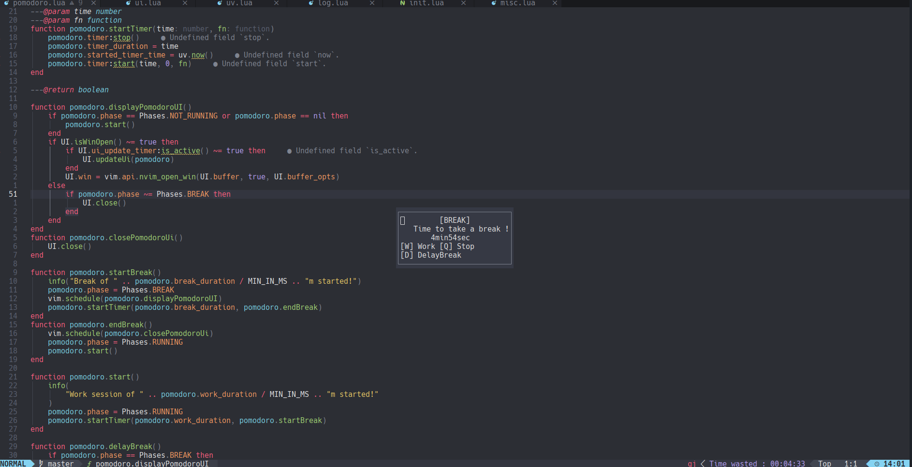

# pomodoro.nvim

Use the Pomodoro Technique in Neovim with built-in session tracking and break reminders.



- install using [lazy.nvim](https://github.com/folke/lazy.nvim)

```lua
  {
    "quentingruber/pomodoro.nvim",
    lazy = false, -- needed so the pomodoro can start at launch
    opts = {
      start_at_launch = true,
      work_duration = 25,
      break_duration = 5,
      delay_duration = 1, -- The additionnal work time you get when you delay a break
      long_break_duration = 15,
      breaks_before_long = 4,
    },
  },

```

## Usage

| Command               | Description                                             |
| --------------------- | ------------------------------------------------------- |
| `:PomodoroStart`      | Start the Pomodoro timer.                               |
| `:PomodoroStop`       | Stop the Pomodoro timer.                                |
| `:PomodoroUI`         | Display the Pomodoro UI.                                |
| `:PomodoroSkipBreak`  | Skip the current break and start the next work session. |
| `:PomodoroForceBreak` | Forcefully start a break.                               |
| `:PomodoroDelayBreak` | Delay the current break by a delay duration.            |
